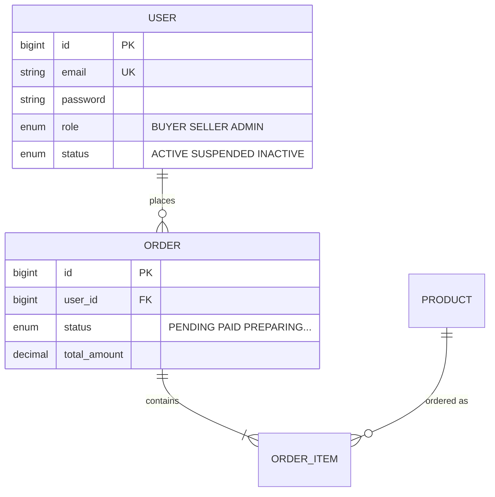

# 3단계 데이터베이스 설계 가이드

> 템플릿: `~/.claude/templates/db-design/` (conceptual, logical, physical)
> 파이프라인: 5단계(개념적) → 6단계(논리적) → 7단계(물리적, 3자 대조)
> 검증: D1-D9 이진 체크리스트 (PASS/FAIL)

요구사항 → 개념적 설계(ERD) → 논리적 설계(정규화) → 물리적 설계(DDL) → Entity 클래스 매핑 → 3방향 검증.

## 의사결정 트리

### IF 새 프로젝트 DB 설계 (Plan)
1. 템플릿 복사: `cp ~/.claude/templates/db-design/*.md <프로젝트>/.claude/design/`
2. **5단계 개념적 설계** — 엔티티 도출 → 관계 정의 → ERD (Mermaid erDiagram)
3. **6단계 논리적 설계** — 정규화(3NF) → 반정규화 판단 → PK/FK/인덱스 후보 → 제약조건
4. **7단계 물리적 설계** — MySQL 타입 매핑 → DDL + 클래스 다이어그램 → 인덱스 생성
5. **MyBatis DTO/VO 매핑** — 테이블 ↔ DTO/VO 클래스 매핑 → MyBatis Mapper XML 작성
6. **D1-D9 3자 대조 검증** — ERD ↔ DDL ↔ Entity 일관성 체크
7. `init/01-schema.sql`, `init/02-index.sql`, `init/03-seed.sql` 생성

### IF 기존 DB 수정 (Implement)
1. 요구사항 변경 확인
2. ERD 업데이트
3. DDL 변경 (ALTER TABLE 또는 init 스크립트 수정)
4. Entity 클래스 수정
5. 3방향 검증 재실행

## 1단계: 개념적 설계

### 엔티티 도출 (명사 추출법)
1. 요구사항 문서/유저 스토리에서 **명사** 추출
2. 필터링 기준으로 엔티티 후보 선별:
   - 독립적으로 존재하는가? (속성이 아닌 독립 개체)
   - 여러 인스턴스가 존재하는가?
   - 고유하게 식별 가능한가?
   - 시스템이 관리해야 하는 데이터인가?
3. 나머지 명사는 속성 후보로 분류

### 관계 정의
| 유형 | 표기 | 예시 | 구현 |
|------|------|------|------|
| 1:1 | `\|\|--\|\|` | User ↔ UserProfile | 같은 테이블 또는 분리 |
| 1:N | `\|\|--o{` | Order → OrderItem | FK를 N쪽에 |
| M:N | `}o--o{` | Student ↔ Course | 연결(junction) 테이블 |

### ERD 작성 (Mermaid erDiagram)


### 추적성 검증
모든 엔티티의 모든 속성이 요구사항(US)에 역추적 가능해야 한다:
- 역추적 불가한 속성 → 불필요하거나 요구사항 누락
- 매핑되지 않는 요구사항 데이터 → 설계 누락

## 2단계: 논리적 설계

### 정규화 프로세스

**1NF**: 모든 속성 값이 원자적(atomic). 반복 그룹 제거.
- 위반: `phone_numbers = "010-1234,010-5678"` → 별도 테이블로 분리

**2NF**: 1NF + 부분 함수 종속 제거. 복합키의 일부에만 종속되는 속성 분리.
- 위반: `(student_id, course_id) → course_name` → course 테이블 분리

**3NF**: 2NF + 이행적 함수 종속 제거. 비키 속성이 다른 비키 속성에 종속되면 분리.
- 위반: `employee → dept_id → dept_name` → department 테이블 분리

### 반정규화 판단
| 상황 | 권장 |
|------|------|
| 읽기 > 90% | 반정규화 고려 (JOIN 비용 절감) |
| 쓰기 빈번 | 정규화 유지 (갱신 이상 방지) |
| 집계 쿼리 빈번 | 파생 컬럼 추가 (예: `average_rating`) |

반정규화 기법: 파생 컬럼 추가, 1:1 테이블 병합, JSON 컬럼 사용 (MySQL 5.7: JSON_EXTRACT/JSON_SET 등 기본 함수만 지원, JSON_TABLE/JSON_ARRAYAGG 미지원)

### PK 전략
- **대리키(Surrogate) 권장**: `BIGINT AUTO_INCREMENT` — 불변, 단순
- **자연키(Natural)**: 절대 변하지 않는 경우만 (코드 테이블)
- UUID PK 지양: B-Tree 인덱스 분할 → INSERT 성능 저하. 외부 노출용은 별도 컬럼

### FK 및 참조 무결성
- `ON DELETE RESTRICT` (기본, 가장 안전)
- `ON DELETE CASCADE` (부모-자식 동시 삭제: Order → OrderItem)
- DDD Aggregate 간 참조는 FK 컬럼 직접 매핑 (BIGINT ID 컬럼으로 참조)

### 인덱스 후보 식별
1. WHERE 절 빈번 조건 컬럼
2. JOIN 조건 컬럼 (FK, InnoDB FK는 자동 인덱스)
3. ORDER BY / GROUP BY 컬럼
4. 복합 인덱스: 등호(=) → 범위(>) → 정렬 순서
5. 카디널리티 높은 컬럼 우선

### 제약조건 설계
| 제약 | 용도 | 예시 |
|------|------|------|
| NOT NULL | 필수 값 | `email VARCHAR(255) NOT NULL` |
| UNIQUE | 중복 방지 | `UNIQUE(email)`, `UNIQUE(user_id, product_id)` |
| CHECK | 값 범위 | `CHECK(price >= 0)` — **MySQL 5.7에서는 파싱만 되고 미적용**. 애플리케이션 레벨 검증 필수 |
| DEFAULT | 기본값 | `DEFAULT 'PENDING'`, `DEFAULT CURRENT_TIMESTAMP` |

## 3단계: 물리적 설계 (MySQL 5.7)

### 타입 매핑
| 논리 타입 | MySQL 타입 | 선택 기준 |
|-----------|-----------|-----------|
| 정수 ID | `BIGINT` | 대규모, 미래 확장. INT는 소규모만 |
| 짧은 문자열 | `VARCHAR(n)` | 인덱스 가능, n은 실제 최대 길이 |
| 긴 텍스트 | `TEXT` | 인덱스 불가, 65KB |
| 날짜시간 | `DATETIME` | 시간대 무관한 절대 시점 |
| 타임스탬프 | `TIMESTAMP` | UTC 자동 변환, created_at/updated_at |
| 금액 | `DECIMAL(12,2)` | 정확한 소수점. FLOAT/DOUBLE 금지 |
| 불리언 | `TINYINT(1)` | MySQL BOOLEAN = TINYINT(1) |
| 열거형 | `VARCHAR(20)` | ENUM은 DDL 변경 필요 → VARCHAR 권장 (CHECK는 5.7에서 미적용, 앱 레벨 검증) |

### 문자셋
```sql
ENGINE=InnoDB DEFAULT CHARSET=utf8mb4 COLLATE=utf8mb4_unicode_ci;
```
`utf8mb4`: 이모지 포함 전체 유니코드. MySQL `utf8`은 3바이트만이므로 부족.

### DDL 생성 패턴
```sql
CREATE TABLE orders (
    id           BIGINT        NOT NULL AUTO_INCREMENT,
    user_id      BIGINT        NOT NULL,
    status       VARCHAR(20)   NOT NULL DEFAULT 'PENDING',
    total_amount DECIMAL(12,2) NOT NULL,
    address      VARCHAR(500)  NOT NULL,
    created_at   TIMESTAMP     NOT NULL DEFAULT CURRENT_TIMESTAMP,
    updated_at   TIMESTAMP     NOT NULL DEFAULT CURRENT_TIMESTAMP ON UPDATE CURRENT_TIMESTAMP,

    PRIMARY KEY (id),
    INDEX idx_orders_user_status (user_id, status),
    INDEX idx_orders_status_created (status, created_at),
    -- MySQL 5.7: CHECK 제약조건은 파싱만 되고 적용 안 됨. 애플리케이션 레벨에서 상태값 검증 필수
    CONSTRAINT chk_orders_status CHECK (status IN ('PENDING','PAID','PREPARING','SHIPPING','DELIVERED','CANCELED','REFUND_REQUESTED','REFUNDED'))
) ENGINE=InnoDB DEFAULT CHARSET=utf8mb4 COLLATE=utf8mb4_unicode_ci;
```

### init 스크립트 구조
```
init/
├── 01-schema.sql    # CREATE TABLE (의존성 순서: users → products → orders → ...)
├── 02-index.sql     # CREATE INDEX (schema에 포함 가능)
└── 03-seed.sql      # INSERT 초기 데이터 (ADMIN 계정, 카테고리 등)
```
`docker-entrypoint-initdb.d`에 마운트. 파일명 순서대로 실행.

## 4단계: MyBatis Mapper XML 작성

### DAO 설계 원칙
- 도메인 단위로 DAO(Mapper 인터페이스) 1개씩 생성
- 복합 조회가 필요하면 SQL JOIN으로 처리 (별도 DAO 생성 금지)
- DTO/VO는 Lombok @Getter/@Setter 기반

### 매핑 패턴
```java
// DTO (Lombok)
@Getter @Setter
public class OrderDTO {
    private Long id;
    private Long userId;            // FK 컬럼 직접 매핑
    private String status;
    private BigDecimal totalAmount;
    private String address;
    private List<OrderItemDTO> items; // 1:N 관계는 collection으로 매핑
}

@Getter @Setter
public class OrderItemDTO {
    private Long id;
    private Long orderId;
    private Long productId;         // FK 컬럼 직접 매핑
    private int quantity;
    private int price;
}
```

```xml
<!-- OrderMapper.xml -->
<mapper namespace="com.project.domain.order.dao.OrderMapper">
    <resultMap id="orderResultMap" type="OrderDTO">
        <id property="id" column="id"/>
        <result property="userId" column="user_id"/>
        <result property="status" column="status"/>
        <result property="totalAmount" column="total_amount"/>
        <collection property="items" ofType="OrderItemDTO">
            <id property="id" column="item_id"/>
            <result property="productId" column="product_id"/>
            <result property="quantity" column="quantity"/>
            <result property="price" column="price"/>
        </collection>
    </resultMap>

    <select id="findById" resultMap="orderResultMap">
        SELECT o.*, oi.id AS item_id, oi.product_id, oi.quantity, oi.price
        FROM orders o
        LEFT JOIN order_items oi ON o.id = oi.order_id
        WHERE o.id = #{id}
    </select>
</mapper>
```

### 테이블 ↔ DTO 매핑 규칙 (MyBatis)
| DDL | DTO/VO | MyBatis XML |
|-----|--------|-------------|
| 테이블명 | DTO 클래스명 | `<mapper namespace="...Mapper">` |
| 컬럼명 | 필드명 (camelCase) | `<result property="fieldName" column="column_name"/>` |
| FK 컬럼 (외부 참조) | `Long xxxId` 필드 | `<result property="userId" column="user_id"/>` |
| 1:N 관계 | `List<ChildDTO>` 필드 | `<collection property="items" ofType="...">` |
| N:1 관계 | 중첩 DTO 필드 | `<association property="user" javaType="...">` |
| 복합 유니크 | `UNIQUE(user_id, product_id)` | DDL에서 관리 |

## 5단계: 3자 대조 검증 (D1-D9, 모두 PASS 필수)

| # | 체크 항목 | PASS 기준 | 측정 방법 |
|---|----------|----------|----------|
| D1 | ERD ↔ PRD 커버리지 | 모든 PRD 도메인에 대응 엔티티 존재 | 추적성 매트릭스에서 빈 도메인 = 0 |
| D2 | 속성 역추적 | 모든 엔티티 속성이 US에 역추적 가능 | 역추적 불가 속성 = 0 |
| D3 | 정규화 검증 | 3NF PASS (또는 반정규화 사유 명시) | 정규화 결과 테이블 |
| D4 | 상태값 일치 | PRD 상태 전이 ↔ enum CHECK 값 1:1 | Grep 상태값 대조 |
| D5 | ERD ↔ DDL 일치 | 엔티티 수 = 테이블 수, 속성 = 컬럼 | 3자 대조 매트릭스 |
| D6 | DDL ↔ 클래스 일치 | 테이블 수 = 클래스 수, 컬럼 = 필드 | 3자 대조 매트릭스 |
| D7 | 타입 호환 | BIGINT↔Long, VARCHAR↔String, DECIMAL↔BigDecimal | Read 양쪽 대조 |
| D8 | FK 참조 무결성 | 모든 FK에 ON DELETE 전략 명시 | DDL 내 FK 제약 확인 |
| D9 | 인덱스 완전 | WHERE/ORDER BY 패턴에 인덱스 존재 | 쿼리 패턴 → 인덱스 대조 |

**5단계(개념적)**: D1-D2 검증 (PRD ↔ ERD 커버리지)
**6단계(논리적)**: D3-D4 추가 검증 (정규화 + 상태값)
**7단계(물리적)**: D5-D9 전체 검증 (3자 대조)

### ERD ↔ DDL 상세 대조
- [ ] 모든 ERD 엔티티에 대응 테이블 존재
- [ ] 속성 ↔ 컬럼: 이름, 타입, NULL 허용 일치
- [ ] 관계 ↔ FK: 1:N이 FK로, M:N이 연결 테이블로 구현
- [ ] PK/UK 일치

### DDL ↔ Entity 상세 대조
- [ ] 테이블명 ↔ MyBatis resultMap namespace 일치
- [ ] 컬럼명 ↔ resultMap의 column 속성 일치
- [ ] 컬럼 타입 ↔ Java 타입 호환
- [ ] NOT NULL ↔ primitive(not null) vs wrapper(nullable)
- [ ] FK ↔ Long xxxId 필드 또는 `<collection>`/`<association>` 매핑 일치
- [ ] UNIQUE 제약 ↔ DDL에 정의

### 누락 인덱스 탐지
- [ ] WHERE 조건 패턴 → 인덱스 매핑 확인
- [ ] 복합 조건(status + created_at) → 복합 인덱스 존재 확인
- [ ] ORDER BY 컬럼 → 인덱스 포함 확인
- [ ] FK 컬럼 자동 인덱스 확인 (InnoDB)

## Gotchas

### 물리 설계부터 시작
ERD 없이 DDL부터 만들면 비즈니스 요구사항 누락. 반드시 개념 → 논리 → 물리 순서.

### MyBatis resultMap 매핑 실수
MyBatis에서 `<collection>`이나 `<association>` 사용 시 column 이름이 SQL 결과와 정확히 일치해야 함. JOIN 시 컬럼명 충돌(양쪽 테이블에 id가 있는 경우)은 alias로 구분 필수.

### MySQL 예약어 충돌
`order`, `rank`, `groups`는 예약어. 테이블명에 사용 시 SQL 에러. `orders`, `user_rank`로 변경하거나 백틱으로 감싸기.

### ERD 미업데이트
테이블 수정 후 ERD를 안 고치면 문서가 거짓말. ERD는 항상 최신 상태 유지.

### PRD AC Then 필드 → DB 컬럼 역추적 누락 (2-Strike: ecommerce-v2 회고)
PRD AC의 "Then" 응답에 `updatedAt`이 있는데 DB 테이블에 `updated_at` 컬럼을 빠뜨린 사례 발생. **개념적 설계 시 PRD AC의 모든 Then 응답 필드를 추출하여 DB 속성에 역추적 매핑**해야 한다. 특히 `createdAt`, `updatedAt` 같은 감사(audit) 필드는 모든 테이블에 일관 적용할 것.

### MySQL 5.7 DESC 인덱스 함정 (2-Strike: ecommerce-v2 회고)
`CREATE INDEX idx ON table (col DESC)`는 MySQL 8.0+에서만 유효. MySQL 5.7에서는 DESC 키워드가 무시되고 ASC로 생성됨. DDL에 DESC를 쓰면 의도와 실제가 불일치. MySQL 5.7 프로젝트에서는 **인덱스 정의에 DESC를 사용하지 않는다** (옵티마이저가 역방향 스캔으로 처리).

### auto_increment PK에 UUID 사용
UUID는 B-Tree 인덱스 페이지 분할 → INSERT 성능 저하. PK는 auto_increment BIGINT, 외부 노출용 ID는 별도 컬럼.

### Docker init 스크립트 미반영
`docker-entrypoint-initdb.d`는 볼륨이 비어있을 때만 실행. 스키마 수정 후 `docker volume rm`으로 볼륨 삭제 후 재생성.

## 도구 사용 패턴 (Harness)
- ERD 작성: `Write`로 `.claude/design/04-erd.md`에 Mermaid erDiagram 저장
- DDL 작성: `Write`로 `init/01-schema.sql` 생성
- 시각 검증: Playwright MCP로 mermaid.live 렌더링 → 스크린샷
- 3방향 검증: `Read`로 ERD + DDL + Entity 동시 읽기 → 대조

## 에러 복구 패턴 (Harness)
- ERD ↔ DDL 불일치 → ERD를 SSOT로, DDL 수정
- DDL ↔ Entity 불일치 → DDL을 SSOT로, Entity 수정
- 누락 인덱스 → `Bash(EXPLAIN)`으로 type=ALL 확인 → 인덱스 추가
- init 미반영 → Docker 볼륨 삭제 후 재생성

## Related (신규 그래프 cross-ref)

db-design이 RDBMS 단일 결정에 한정된다면 다음 신규 노드들은 넓힌 결정:
- `data/iceberg-table-format.md` — Iceberg table format spec v2 (schema/partition/snapshot evolution). lakehouse 결정
- `_common/distributed-cache-decisions.md` — Cassandra/EVCache/Redis/DynamoDB 결정 (RDBMS 외 wide-column/KV/managed)
- `data/spark-tuning-checklist.md` — Iceberg 위 Spark write 결정 (`write.distribution-mode=hash`, target-file-size 512MB)
- `_common/dlq-reprocessing-wal.md` — WAL pattern으로 메시지 broker 다운에도 데이터 보존
- `data/kafka-compaction-and-retention.md` — Kafka cleanup.policy + Tiered Storage 3.9 GA + KRaft 4.0
- `ml/feature-store-online-offline.md` — point-in-time correctness + train-serve skew 차단
