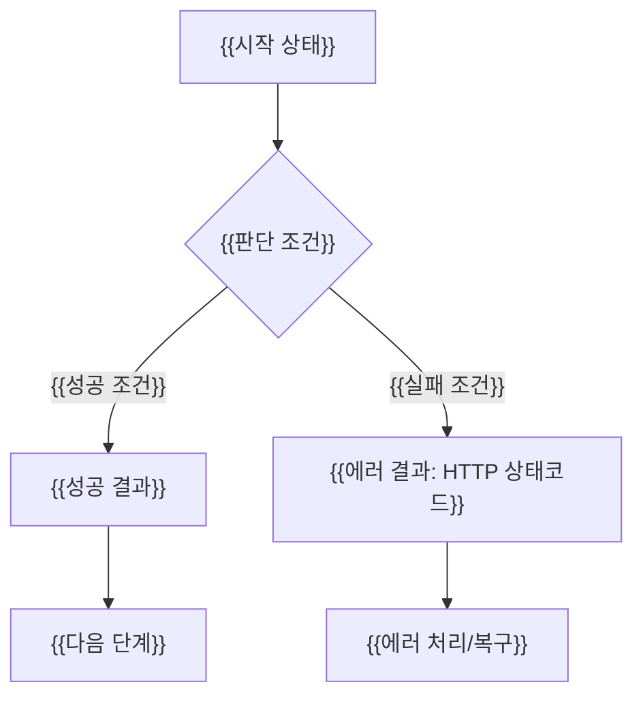
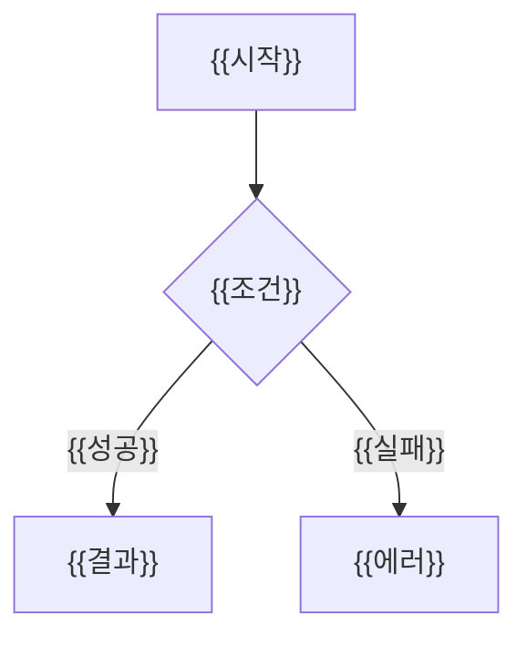
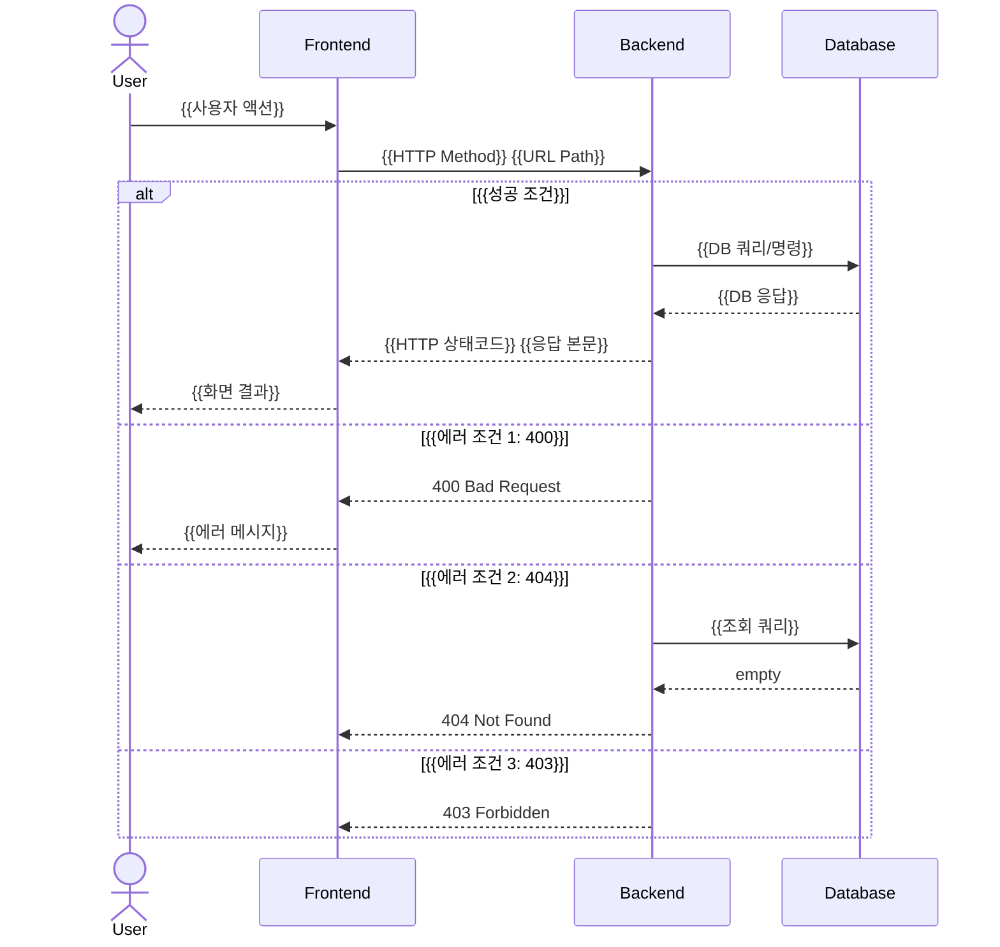

# {{도메인명}} 기능 플로우차트

> PRD 원본: `requirements/domain/{{도메인파일명}}.md`
> 이 파일은 PRD의 시각적 표현. 새 요구사항을 여기에 추가하지 않는다.

---

## 1. 유저 플로우

### US-0XX: {{유저스토리 제목}}



<!--
  작성 규칙:
  - 하나의 US = 하나의 flowchart (너무 복잡하면 happy path / error path 분리)
  - 성공 AC → happy path (실선 화살표)
  - 에러 AC (400/404/403/409) → 각각 에러 분기 노드
  - 분기 노드(다이아몬드 {})는 AC의 Given 조건에서 추출
  - 결과 노드([])는 AC의 Then에서 추출
-->

### US-0XX: {{유저스토리 제목 2}}



---

## 2. 시스템 시퀀스

### US-0XX: {{API명}} ({{HTTP Method}} {{URL Path}})



<!--
  작성 규칙:
  - 하나의 API 엔드포인트 = 하나의 sequenceDiagram
  - participant: PRD architecture.md의 시스템 구성에 맞춤
  - alt/else 블록: 성공 + 에러 AC를 모두 포함
  - 미들웨어/캐시/이벤트 발행이 있으면 participant 추가
  - API URL은 PRD AC의 When 절과 정확히 일치
-->

---

## 3. 상태 전이 다이어그램

<!-- PRD 도메인 파일의 "상태 전이 규칙" 섹션을 Mermaid로 시각화 -->

```mermaid
stateDiagram-v2
    [*] --> {{초기상태}}: {{생성 트리거}}
    {{상태A}} --> {{상태B}}: {{전이 트리거}}
    {{상태B}} --> {{상태C}}: {{전이 트리거}}
    {{상태C}} --> [*]: {{종료 조건}}

    note right of {{상태A}}
        {{비즈니스 규칙/제약 조건}}
    end note
```

**허용 전이**:
| 출발 | 도착 | 트리거 | PRD 근거 |
|------|------|--------|---------|
| {{상태A}} | {{상태B}} | {{트리거}} | US-0XX AC |

**금지 전이**:
| 출발 | 도착 | 사유 |
|------|------|------|
| {{상태X}} | {{상태Y}} | {{금지 사유}} |

---

## 추적성 매트릭스

| PRD US ID | 유저 플로우 | 시스템 시퀀스 | 상태 전이 | 비고 |
|-----------|-----------|-------------|----------|------|
| US-0XX | flowchart §1 | sequence §1 | — | |
| US-0XX | flowchart §2 | sequence §2 | state §1 | 상태 변경 포함 |

<!--
  검증 기준:
  - 이 테이블의 모든 US ID = PRD 도메인 파일의 전체 US ID (빠짐없이)
  - 유저 플로우 열: 비어있으면 = 해당 US의 플로우 시각화 누락
  - 시스템 시퀀스 열: 비어있으면 = 해당 US의 API 시퀀스 누락
  - 상태 전이 열: 상태 변경 없는 US는 "—"으로 표시 (의도적 제외)
-->

---

<!-- 작성 체크리스트 (작성 완료 후 삭제) -->
<!--
- [ ] PRD 도메인 파일의 모든 US에 대해 유저 플로우 작성
- [ ] PRD 도메인 파일의 모든 API에 대해 시스템 시퀀스 작성
- [ ] 모든 에러 AC (400/404/403/409)가 flowchart 분기 또는 sequence alt에 반영
- [ ] 상태 전이 텍스트 규칙 = stateDiagram 노드 (1:1)
- [ ] 금지 전이도 명시
- [ ] 시퀀스의 API URL = PRD AC의 When 절 URL과 정확히 일치
- [ ] 추적성 매트릭스 완성 (모든 US ID 나열)
- [ ] 고아 노드 없음 (모든 플로우 노드가 US에 역추적 가능)
-->
