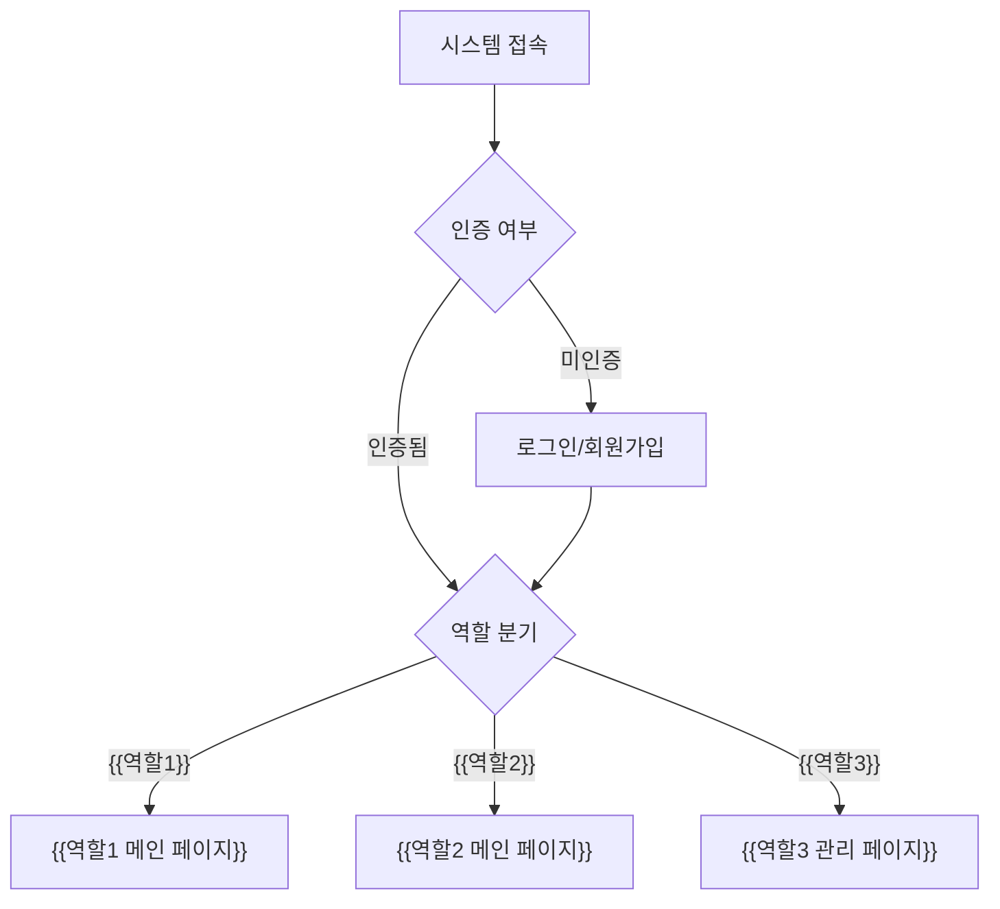
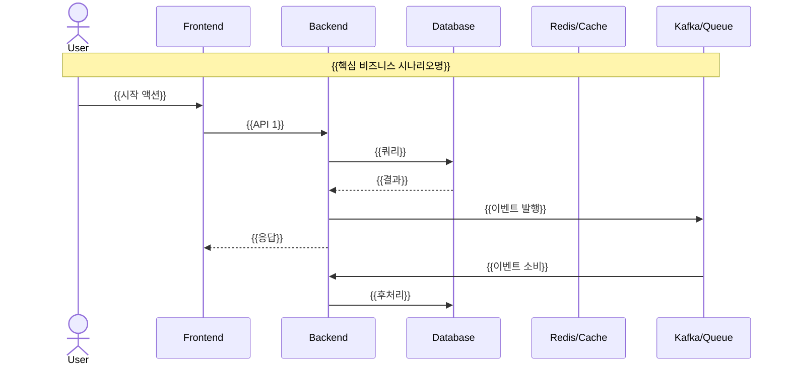

# 시스템 전체 흐름 개요

> PRD 원본: `requirements/context.md` + `requirements/architecture.md`
> 도메인 간 연결을 조감도로 시각화. 세부 흐름은 도메인별 파일에서.

---

## 1. 역할별 시스템 진입 플로우



<!--
  역할은 context.md의 Personas에서 추출.
  각 역할의 메인 진입점을 명시.
-->

---

## 2. 핵심 비즈니스 플로우 (도메인 횡단)


<!--
  예시: 상품 검색 → 장바구니 → 주문 → 결제 → 배송 → 알림
  각 도메인의 핵심 흐름만 표현. 세부 분기는 도메인별 파일.
-->

---

## 3. 시스템 아키텍처 시퀀스 (전체 흐름)



<!--
  architecture.md의 동기/비동기 경계와 일치해야 한다.
  동기 호출: 실선 화살표 (->>)
  비동기 이벤트: 점선 화살표 (-->>)
  participant 목록은 architecture.md 시스템 구성과 일치.
-->

---

## 도메인 간 의존성

```mermaid
flowchart TD
    {{도메인1}}["{{도메인1}}"] --> {{도메인2}}["{{도메인2}}"]
    {{도메인2}} --> {{도메인3}}["{{도메인3}}"]
    {{도메인3}} --> {{도메인4}}["{{도메인4}}"]
    {{도메인4}} -.->|"이벤트"| {{도메인5}}["{{도메인5}}"]
```

<!--
  실선: 동기 의존 (API 호출)
  점선: 비동기 의존 (이벤트)
  architecture.md의 의존성 정의와 일치.
-->

---

## 추적성

| 도메인 | 플로우 파일 | PRD 원본 | US 수 |
|--------|-----------|---------|-------|
| {{도메인1}} | `flows/{{도메인1}}.md` | `domain/{{도메인1}}.md` | {{N}} |
| {{도메인2}} | `flows/{{도메인2}}.md` | `domain/{{도메인2}}.md` | {{N}} |

<!--
  검증 기준:
  - 이 테이블의 도메인 목록 = PRD index.md의 도메인 목록 (빠짐없이)
  - 모든 도메인에 대응하는 플로우 파일 존재
-->
